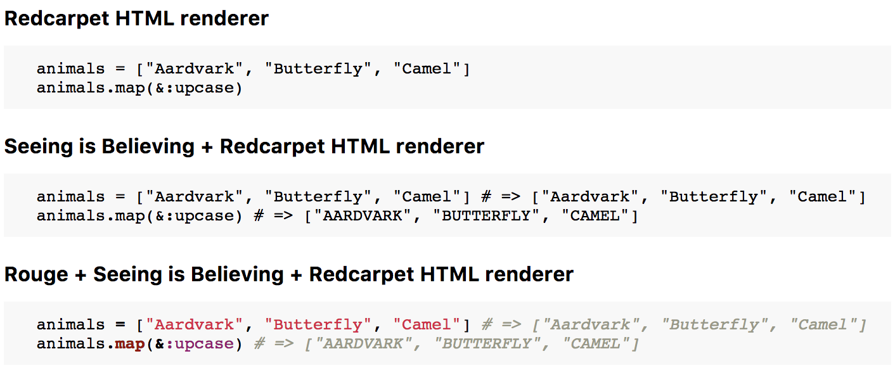

# Redcarpet::Render::SeeingIsBelieving

[](https://travis-ci.org/odlp/redcarpet-render-seeing_is_believing)

Powerup the Ruby examples in your markdown. Combines the excellent
[Redcarpet][redcarpet] (a markdown parser) with [Seeing Is Believing][sib],
which shows the evaluated result from each line of code.

If your markdown includes a fenced code block with `ruby+` specified as the
language:

<pre><code>```ruby+
  animals = ["Aardvark", "Butterfly", "Camel"]
  animals.map(&:upcase)
```</code></pre>

Then you'll see the result of each line of code:



## Usage

```ruby
require "redcarpet-render-seeing_is_believing"
require "redcarpet"

class MyCustomHtmlRenderer < Redcarpet::Render::HTML
  prepend Redcarpet::Render::SeeingIsBelieving

  def block_code(code, language)
    "<pre><code>#{code}</code></pre>"
  end
end

Redcarpet::Markdown.new(MyCustomHtmlRenderer, fenced_code_blocks: true).
  render("some markdown!")
```

or combine with [Rouge][rouge] syntax highlighter:

[rouge]: https://github.com/jneen/rouge

```ruby
require "redcarpet-render-seeing_is_believing"
require "redcarpet"
require "rouge"
require "rouge/plugins/redcarpet"

class MyCustomHtmlRenderer < Redcarpet::Render::HTML
  include Rouge::Plugins::Redcarpet
  prepend Redcarpet::Render::SeeingIsBelieving
end

Redcarpet::Markdown.new(MyCustomHtmlRenderer, fenced_code_blocks: true).
  render("some markdown!")
```

[redcarpet]: https://github.com/vmg/redcarpet
[sib]: https://github.com/JoshCheek/seeing_is_believing

## TODO

- Ignore exceptions / failed evaluations by default
- Allow comments to be scoped to specific lines
